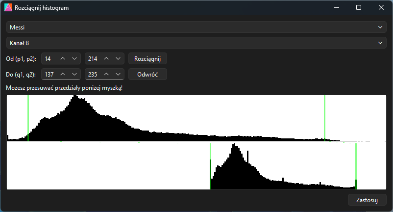
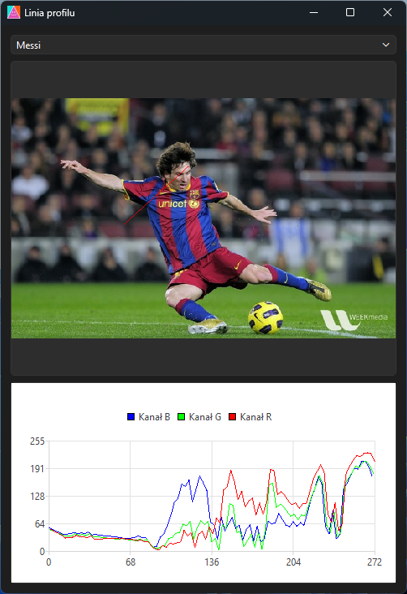
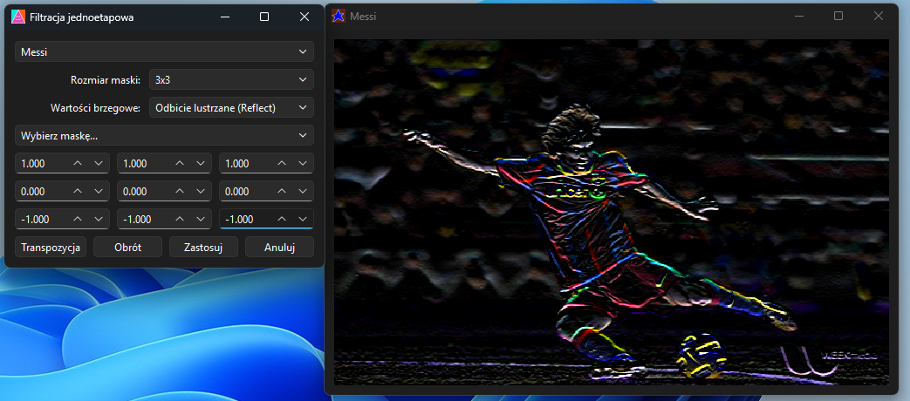

# Program do Algorytmicznego Przetwarzania Obrazów

Napisane w C++ 20, z użyciem Qt 6 oraz OpenCV 4.13

## Funkcje
- Edycja LUT
- Rozdzielanie na kanały
- Skalowanie
- Konwersja formatu
- Rysowanie histogramu
- Wyrównywanie histogramu
- Rozciąganie histogramu
- Rozciąganie selektywne histogramu
- Posteryzacje
- Filtracja jednoetapowa i dwuetapowa
- Operacje dwuargumentowe
- Operacje morfologiczne
- Detekcje linii
- Piramida obrazów
- Linia profilu
- Konwersja na obraz binarny poprzez wybranie progu
- Segmentacja obrazu poprzez GrabCut
- Segmentacja obrazu poprzez Watershed
- Algorytm Inpaint
- Analiza cech obiektów obrazu
- Detekcja twarzy z kamerki poprzez kaskadowy filtr Haara

## Zdjęcia z programu

